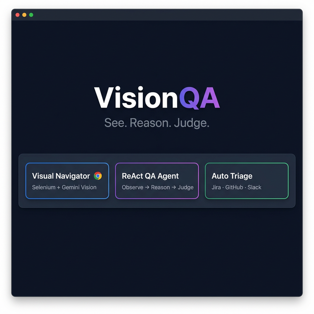
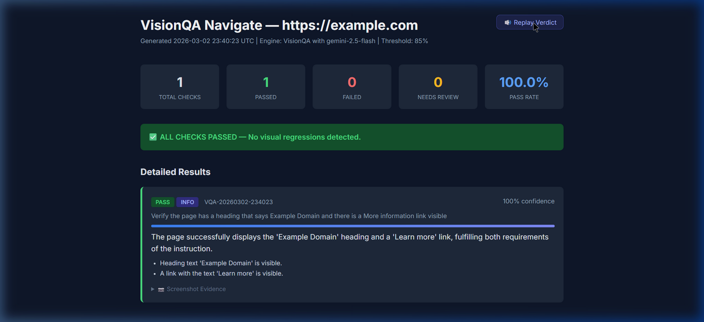
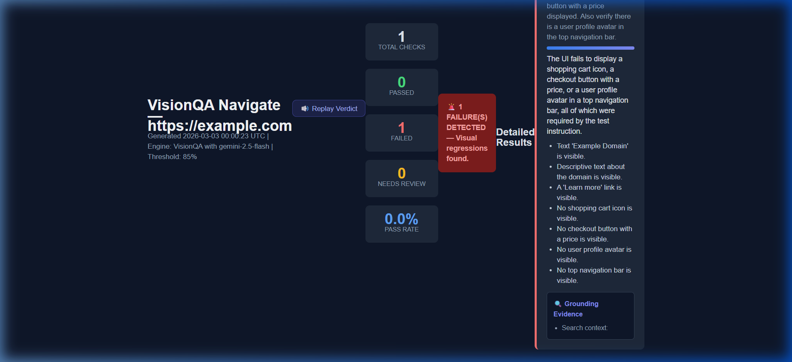
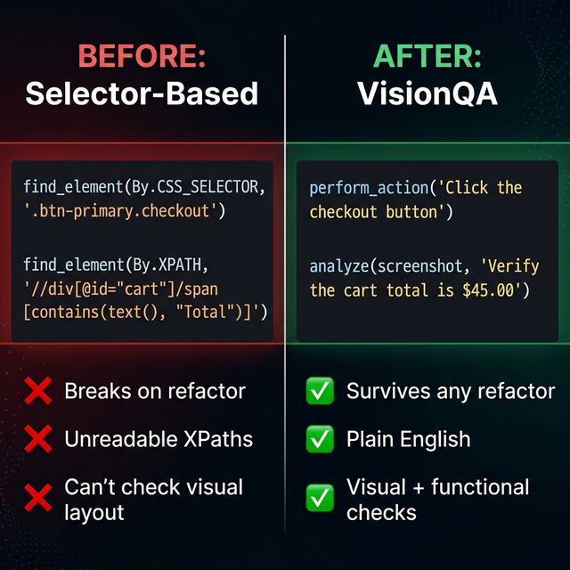
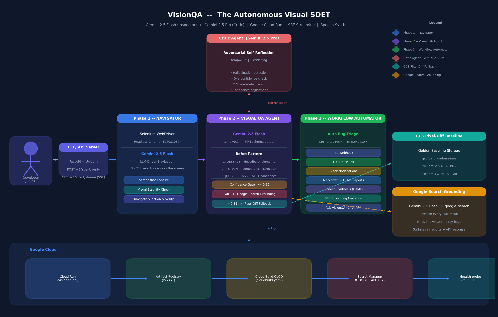
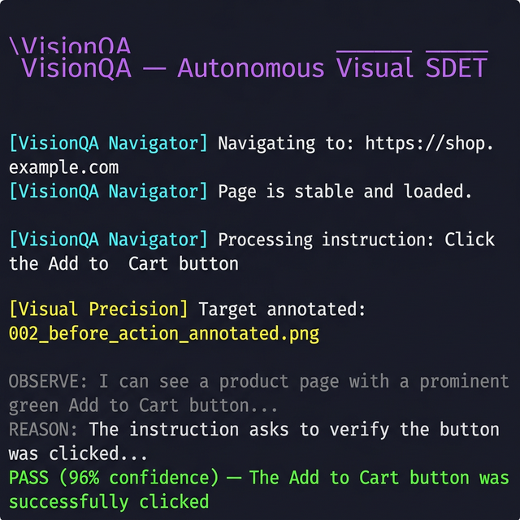
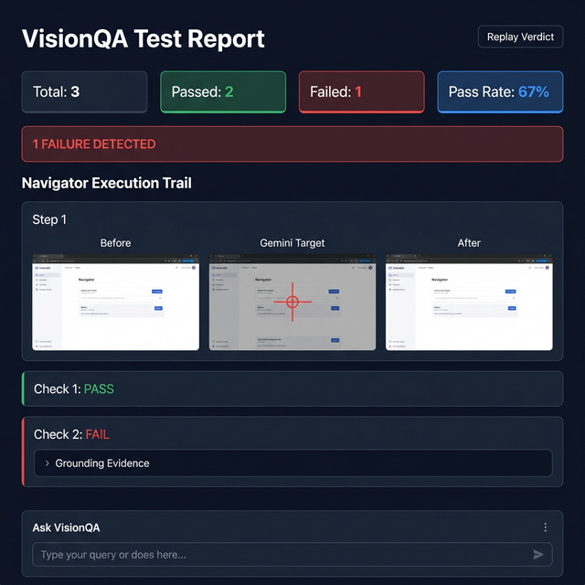

# VisionQA — The Ultimate Guide for QA Teams

> **Version 1.0** · March 2026  
> Powered by Gemini 2.5 Flash (Inspector) + Gemini 2.5 Pro (Critic)  
> Deployed on Google Cloud Run

<p align="center">
  
</p>

---

## Table of Contents

1. [Demo Videos](#demo-videos)
2. [What Is VisionQA?](#1-what-is-visionqa)
3. [Why VisionQA Exists — The Problem](#2-why-visionqa-exists)
4. [How It Works — Architecture](#3-how-it-works)
5. [Getting Started (5-Minute Quickstart)](#4-getting-started)
6. [CLI Reference](#5-cli-reference)
7. [API Reference](#6-api-reference)
8. [Replacing Selenium Selectors — Migration Guide](#7-migration-guide)
9. [Writing Your First VisionQA Test](#8-writing-your-first-test)
10. [Advanced Features](#9-advanced-features)
11. [CI/CD Integration](#10-cicd-integration)
12. [FAQ](#11-faq)

---

## Demo Videos

### Part 1 — API & Swagger UI

Full walkthrough of the VisionQA REST API — health check, all endpoints, live request/response.


### Part 2 — Live Gemini Analysis

Real-time analysis of example.com via the `/v1/agent/navigate` endpoint — Gemini returns PASS at 100% confidence.


### Part 3 — HTML Report with Speech & Chat

Walkthrough of the generated HTML report — statistics, verdict, Replay Verdict speech, and interactive Ask VisionQA chat.


### Live Screenshot — HTML Report

<p align="center">
  
</p>
<p align="center"><em>Generated HTML report showing PASS verdict at 100% confidence with speech synthesis and chat panel</em></p>

### Part 4 — FAIL Test (Grounding Evidence)

Deliberately failing test: asked VisionQA to find a shopping cart, checkout button, and user avatar on example.com — Gemini correctly returns **FAIL at CRITICAL severity** with Google Search grounding evidence.


### Part 5 — FAIL Report UI

The FAIL HTML report shows red indicators, 0% pass rate, detailed observations of what's missing, and grounding evidence links.


### Live Screenshot — FAIL Report

<p align="center">
  
</p>
<p align="center"><em>FAIL report showing CRITICAL severity, detailed observations, and Google Search grounding evidence</em></p>

---

## 1. What Is VisionQA?

VisionQA is an **autonomous visual QA agent** that tests web applications the way a human tester does — by **looking at the screen**. Instead of relying on CSS selectors, XPaths, or `data-testid` attributes, VisionQA sends a screenshot to Google's Gemini 2.5 Flash model and asks it to evaluate the UI against a plain-English instruction.

### One-Sentence Summary

> VisionQA replaces brittle selector-based test assertions with vision-based reasoning — you describe **what** to check in English, and the agent **sees** the screen and judges PASS or FAIL.

### What It Is

- A Python library + CLI + REST API
- Built on top of Selenium (Chrome WebDriver)
- Powered by Google Gemini 2.5 Flash & Pro
- Deployed on Google Cloud Run

### What It Is NOT

- A replacement for Selenium — it sits **on top** of Selenium
- A unit testing framework — it tests rendered UI, not code
- A record-and-replay tool — it understands intent, not coordinates

---

## 2. Why VisionQA Exists

### The Selector Problem

Every QA team eventually hits the same wall:

```python
# This test breaks the moment a developer changes a class name
driver.find_element(By.CSS_SELECTOR, ".btn-primary.checkout-cta").click()
```

| Pain Point | Impact |
|---|---|
| CSS selectors break on every refactor | Hours spent fixing tests, not writing them |
| XPaths are fragile and unreadable | Junior QAs struggle to maintain them |
| No way to assert "does this look right?" | Layout bugs slip through to production |
| Selector maintenance scales linearly | 200 tests = 200 points of failure |

### The VisionQA Solution

```python
# This test survives any refactor — it describes INTENT, not implementation
nav.perform_action("Click the checkout button")
result = agent.analyze(screenshot, "Verify the order summary is displayed correctly")
assert result.status == "PASS"
```

The test describes what a human QA would look for. The element can be renamed, moved, or restyled — the test still passes as long as the **user experience** is correct.

<p align="center">
  
</p>
<p align="center"><em>Traditional Selenium selectors (left) vs VisionQA natural-language instructions (right)</em></p>

---

## 3. How It Works

### Architecture Diagram

<p align="center">
  
</p>

### The Three Phases

#### Phase 1 — Navigator (Selenium + Gemini)

The Navigator drives a headless Chrome browser using Gemini's vision instead of selectors:

```
Your instruction: "Click the Login button"
                        │
                        ▼
            ┌───────────────────────┐
            │  Gemini 2.5 Flash     │
            │  sees the screenshot  │──→ "I see a blue Login button at the top-right"
            │  reasons about intent │──→ "The user wants to click it"
            │  returns coordinates  │──→ target: {label: "Login", type: "button"}
            └───────────────────────┘
                        │
                        ▼
            ┌───────────────────────┐
            │  Selenium WebDriver   │──→ Finds and clicks the element
            └───────────────────────┘
```

**Visual Precision Proof:** After every action, VisionQA saves an annotated screenshot with a red crosshair showing exactly which element Gemini chose to interact with (`*_annotated.png`).

#### Phase 2 — Visual QA Agent (ReAct Pattern)

The core analysis follows a strict 3-step reasoning chain:

| Step | What Happens | Why |
|---|---|---|
| **1. OBSERVE** | Gemini describes exactly what it sees in the screenshot | Prevents hallucination — it must commit to observations first |
| **2. REASON** | Compares observations against your test instruction | Forces logical connection between evidence and judgment |
| **3. JUDGE** | Returns PASS/FAIL with a confidence score (0.0–1.0) | Score drives automation decisions downstream |

If confidence falls below **0.85**, the result is flagged `NEEDS_REVIEW` and a pixel-diff baseline comparison runs automatically.

If the result is **FAIL**, a Google Search grounding call fires to find known CSS/accessibility issues.

#### Phase 3 — Workflow Automator

On failure, VisionQA automatically:
- Creates a **Jira ticket** or **GitHub Issue** with the bug details
- Sends a **Slack notification** with severity and screenshots
- Generates **Markdown + HTML reports** (the HTML report speaks the verdict aloud)

### Dual-Model Self-Reflection

VisionQA uses two Gemini models in a chain:

| Model | Role | Temperature |
|---|---|---|
| **Gemini 2.5 Flash** | Primary inspector — runs the ReAct analysis | 0.1 (precise) |
| **Gemini 2.5 Pro** | Adversarial critic — checks for hallucination, overconfidence, missed defects | 0.2 (exploratory) |

The Critic can adjust the confidence score downward or override the verdict entirely. Enable it with `--critic`.

---

## 4. Getting Started

### Prerequisites

| Requirement | Version |
|---|---|
| Python | 3.11+ |
| Google Chrome | Latest stable |
| Google API Key | [Get one free](https://aistudio.google.com) |

### Installation

```bash
# Clone the repository
git clone https://github.com/EtornamKoko/VisionQA.git
cd VisionQA

# Create virtual environment
python -m venv .venv
.venv\Scripts\activate          # Windows
# source .venv/bin/activate     # macOS/Linux

# Install dependencies
pip install -r requirements.txt

# Configure
cp .env.example .env
# Edit .env and add: GOOGLE_API_KEY=your_key_here
```

### Verify Installation

```bash
# Run the test suite (no API key needed — all tests use mocks)
python -m pytest tests/ -v

# Expected: 54 passed
```

### First Real Analysis

Take a screenshot of any webpage and run:

```bash
python main.py --image screenshot.png --prompt "Verify the page loaded correctly" --stream
```

You'll see Gemini's reasoning stream live in your terminal, followed by a structured PASS/FAIL verdict.

<p align="center">
  
</p>
<p align="center"><em>VisionQA CLI streaming Gemini's reasoning tokens in real time</em></p>

---

## 5. CLI Reference

### Modes

| Command | Description |
|---|---|
| `--image PATH` | Analyze a local screenshot |
| `--url URL` | Navigate to a URL, take a screenshot, run QA |
| `--live URL` | Continuously monitor a URL at an interval |
| `--serve` | Start the FastAPI REST API server |

### Options

| Flag | Description | Default |
|---|---|---|
| `--prompt TEXT` | The test instruction in plain English | Required |
| `--steps STEP1 STEP2...` | Navigation steps before QA (with `--url`) | None |
| `--critic` | Enable the Critic self-reflection pass | Off |
| `--baseline NAME` | Compare against a pixel-diff golden baseline | None |
| `--stream` | Stream Gemini reasoning tokens live | Off |
| `--interval N` | Seconds between checks in `--live` mode | 30 |

### Examples

```bash
# Simple screenshot check
python main.py --image checkout.png --prompt "Verify the total price is shown"

# Navigate + interact + verify (with streaming)
python main.py --url https://myapp.com/login \
  --steps "Type admin@test.com in the email field" \
          "Type password123 in the password field" \
          "Click the Sign In button" \
  --prompt "Verify the dashboard shows a welcome message" \
  --stream --critic

# Live monitoring (Ctrl+C to stop)
python main.py --live https://myapp.com \
  --prompt "Verify the page is not showing an error" \
  --interval 60

# Start API server
python main.py --serve
```

### Exit Codes (CI/CD Compatible)

| Code | Meaning |
|---|---|
| `0` | All checks PASS |
| `1` | At least one FAIL detected |
| `2` | Configuration or input error |

---

## 6. API Reference

Start the server with `python main.py --serve`. Swagger docs at `http://localhost:8080/docs`.

### `GET /health`

Health check for load balancers.

```json
{"status": "ok", "version": "1.0.0", "model": "gemini-2.5-flash", "confidence_threshold": 0.85}
```

### `POST /v1/agent/verify`

Analyze a single screenshot.

```bash
curl -X POST http://localhost:8080/v1/agent/verify \
  -F "screenshot=@page.png" \
  -F "instruction=Verify the login form is visible"
```

**Response:**
```json
{
  "status": "PASS",
  "analysis": "Login form with email and password fields is clearly visible",
  "confidence": 0.96,
  "severity": "INFO",
  "bug_id": "VQA-20260302-abc123",
  "observations": ["Email input field present", "Password input field present", "Submit button visible"],
  "grounding_notes": [],
  "timestamp": "2026-03-02T23:00:00Z"
}
```

### `POST /v1/agent/stream`

Same as `/verify` but returns Server-Sent Events for real-time narration.

```bash
curl -N -X POST http://localhost:8080/v1/agent/stream \
  -F "screenshot=@page.png" \
  -F "instruction=Check the button"
```

### `POST /v1/agent/navigate`

Full autonomous navigation flow — navigate, interact, QA, report.

```bash
curl -X POST http://localhost:8080/v1/agent/navigate \
  -H "Content-Type: application/json" \
  -d '{
    "url": "https://example.com",
    "steps": ["Click the Login link", "Type test@demo.com in email"],
    "qa_prompt": "Verify the dashboard loaded",
    "run_critic": true
  }'
```

**Response includes:**
- `flow_status` — overall PASS/FAIL
- `nav_steps[]` — per-step results with annotated screenshot paths
- `qa_results[]` — structured QA verdict
- `report_path` — path to the generated HTML report

### `POST /v1/agent/chat`

Conversational Q&A about report results.

```bash
curl -X POST http://localhost:8080/v1/agent/chat \
  -H "Content-Type: application/json" \
  -d '{"question": "Why did Check 1 fail?", "context": "The login button was expected but not found"}'
```

---

## 7. Migration Guide

### From Traditional Selenium to VisionQA

#### Before (Selector-Based)

```python
def test_checkout(driver):
    driver.get("https://shop.com")
    driver.find_element(By.CSS_SELECTOR, ".product-card:first-child .add-btn").click()
    driver.find_element(By.ID, "cart-icon").click()
    
    total = driver.find_element(By.CSS_SELECTOR, ".cart-total .price").text
    assert "$29.99" in total
    
    checkout_btn = driver.find_element(By.XPATH, "//button[contains(text(), 'Checkout')]")
    assert checkout_btn.is_displayed()
```

#### After (VisionQA)

```python
def test_checkout(browser, vqa):
    browser.navigate_to("https://shop.com")
    browser.perform_action("Click the Add to Cart button on the first product")
    browser.perform_action("Click the shopping cart icon")
    
    screenshot = browser.take_screenshot("cart_page")
    
    result = vqa.analyze(screenshot, "Verify the cart total shows $29.99 and the Checkout button is visible")
    assert result.status == "PASS", result.analysis
```

### What Changes, What Stays

| Your Existing Pattern | VisionQA Equivalent |
|---|---|
| `driver.get(url)` | `browser.navigate_to(url)` |
| `find_element(By.CSS_SELECTOR, x).click()` | `browser.perform_action("Click the X button")` |
| `find_element(By.ID, x).send_keys(val)` | `browser.perform_action("Type val in the X field")` |
| `assert element.text == "..."` | `vqa.analyze(screenshot, "Verify text shows ...")` |
| `assert element.is_displayed()` | `vqa.analyze(screenshot, "Verify X is visible")` |
| Page Object Model | Keep the pattern — replace method internals |
| pytest fixtures | Add `browser` and `vqa` fixtures (see below) |
| CI/CD pipeline | Swap `pytest tests/` — exit codes are the same |

### Recommended pytest Setup

```python
# conftest.py
import pytest
from vision.visual_qa_agent import VisualQAAgent
from navigator.web_navigator import WebNavigator

@pytest.fixture
def vqa():
    """Visual QA agent fixture."""
    return VisualQAAgent()

@pytest.fixture
def browser():
    """Headless browser with AI navigation."""
    with WebNavigator(headless=True) as nav:
        yield nav
```

### Gradual Migration Strategy

You do NOT need to rewrite everything at once:

| Timeline | Action |
|---|---|
| **Week 1** | Keep all Selenium tests. Add VisionQA only for visual assertions (layout, styling, accessibility) — things Selenium can't check at all |
| **Week 2–3** | Replace the 5–10 most brittle selectors with `perform_action()` calls. Typically: login flows, form fills, navigation menus |
| **Month 2+** | Write all new feature tests in VisionQA from day 1. Existing stable Selenium tests can stay — no reason to migrate what isn't breaking |

---

## 8. Writing Your First Test

### Example: Testing a Login Flow

```python
# tests/test_login.py
from navigator.web_navigator import WebNavigator
from vision.visual_qa_agent import VisualQAAgent

def test_successful_login():
    agent = VisualQAAgent()
    
    with WebNavigator(headless=True) as nav:
        # Step 1: Navigate
        nav.navigate_to("https://myapp.com/login")
        
        # Step 2: Interact (Gemini finds the elements visually)
        nav.perform_action("Type testuser@example.com into the email field")
        nav.perform_action("Type SecurePass123 into the password field")
        nav.perform_action("Click the Sign In button")
        
        # Step 3: Capture the result
        screenshot = nav.take_screenshot("post_login")
    
    # Step 4: Visual assertion
    result = agent.analyze(
        screenshot,
        "Verify the dashboard page loaded successfully with a welcome heading"
    )
    
    assert result.status == "PASS", f"Login test failed: {result.analysis}"
    assert result.confidence >= 0.85, f"Low confidence: {result.confidence}"


def test_login_error_shown():
    agent = VisualQAAgent()
    
    with WebNavigator(headless=True) as nav:
        nav.navigate_to("https://myapp.com/login")
        nav.perform_action("Type wrong@email.com into the email field")
        nav.perform_action("Type badpassword into the password field")
        nav.perform_action("Click the Sign In button")
        
        screenshot = nav.take_screenshot("login_error")
    
    result = agent.analyze(
        screenshot,
        "Verify an error message is displayed indicating invalid credentials"
    )
    
    assert result.status == "PASS", "Expected an error message to be shown"
```

### Writing Good Test Instructions

| ❌ Bad Instruction | ✅ Good Instruction | Why |
|---|---|---|
| "Check the page" | "Verify the page title says 'Dashboard'" | Too vague — be specific |
| "Is the button there?" | "Verify the blue Submit button is visible and enabled" | Describe what you expect |
| "Check everything" | "Verify the form has email, password, and submit fields" | One focused check per assertion |
| "Click button" | "Click the green Add to Cart button" | Add distinguishing details |

**Rule of thumb:** Write the instruction as if you're telling a new QA team member what to verify on their first day. Be specific, be visual, be actionable.

---

## 9. Advanced Features

### 9.1 Critic Mode (Self-Reflection)

Enable with `--critic` or `run_critic=True`. The Gemini 2.5 Pro model reviews the Flash model's analysis for:

- **Hallucination** — did Flash claim to see something that isn't there?
- **Overconfidence** — is 98% confidence justified for a complex assertion?
- **Missed defects** — did Flash overlook a visible issue?

```bash
python main.py --image page.png --prompt "Check the layout" --critic
```

### 9.2 Google Search Grounding

When a FAIL is detected, VisionQA automatically runs a Google Search via Gemini to find known browser compatibility issues, CSS bugs, or accessibility problems related to the defect. Results appear in:
- HTML reports under "Grounding Evidence"
- API responses in the `grounding_notes` field
- Markdown reports in a dedicated section

### 9.3 Speech Synthesis (HTML Reports)

Open any HTML report in a browser and VisionQA speaks the verdict aloud:

> *"VisionQA verdict. 2 failures detected. Pass rate: 50 percent."*

A **Replay Verdict** button in the header lets you replay or mute.

### 9.4 Live Monitoring Mode

Watch a URL continuously with streaming analysis:

```bash
python main.py --live https://production.myapp.com \
  --prompt "Verify the homepage is not showing a 500 error" \
  --interval 60
```

Each check streams Gemini's reasoning to the terminal. A countdown timer shows time until the next check. Press Ctrl+C to stop.

### 9.5 Pixel-Diff Baseline Fallback

When confidence is low, VisionQA compares against a golden baseline stored in Google Cloud Storage:

```bash
# Save a baseline
python main.py --image golden.png --prompt "Baseline for homepage" --baseline homepage_v1

# Future runs compare against it
python main.py --image current.png --prompt "Check homepage" --baseline homepage_v1
```

If the pixel difference is < 5%, the result is PASS. ≥ 5% is FAIL.

### 9.6 Navigator Execution Trail (HTML Reports)

When running URL-based flows (`--url` or `/v1/agent/navigate`), the HTML report includes a **Navigator Execution Trail** section showing each step with three side-by-side screenshots:

| Before | Gemini Target | After |
|---|---|---|
| Raw page before action | Annotated with red crosshair on the chosen element | Page after the action was executed |

This gives QA leads — and stakeholders — visual proof that the agent **understood** the page context rather than blindly clicking.

<p align="center">
  
</p>
<p align="center"><em>HTML report with Navigator Execution Trail, speech synthesis, grounding evidence, and chat panel</em></p>

---

## 10. CI/CD Integration

### Exit Code Convention

VisionQA follows Unix conventions — `0` = success, `1` = failure, `2` = error. This plugs directly into any CI pipeline.

### GitHub Actions Example

```yaml
name: Visual QA
on: [push, pull_request]

jobs:
  visual-qa:
    runs-on: ubuntu-latest
    steps:
      - uses: actions/checkout@v4
      - uses: actions/setup-python@v5
        with:
          python-version: '3.11'
      
      - run: pip install -r requirements.txt
      
      - name: Run VisionQA Tests
        env:
          GOOGLE_API_KEY: ${{ secrets.GOOGLE_API_KEY }}
        run: python -m pytest tests/ -v
      
      - name: Upload Reports
        if: always()
        uses: actions/upload-artifact@v4
        with:
          name: visionqa-reports
          path: reports/
```

### Cloud Run Deployment

```bash
# One-command deploy
gcloud builds submit --config cloudbuild.yaml

# The API is available at:
# POST https://your-service-url/v1/agent/verify
# POST https://your-service-url/v1/agent/navigate
# POST https://your-service-url/v1/agent/stream
```

### Integration with Existing Pipelines

```bash
# Add to any CI script — works with Jenkins, GitLab CI, CircleCI, etc.
python main.py --image "$SCREENSHOT_PATH" \
  --prompt "Verify the deployment succeeded" \
  --critic

# Exit code tells the pipeline to pass or fail
```

---

## 11. FAQ

### General

**Q: Does VisionQA replace Selenium?**  
A: Partially. VisionQA **uses** Selenium for browser automation but replaces the selector-finding layer. Selenium drives Chrome; Gemini decides where to click. Think of it as self-driving mode for Selenium.

**Q: How much does it cost to run?**  
A: Gemini 2.5 Flash pricing is pay-per-use. A typical screenshot analysis costs ~$0.001–0.002. A 200-test suite costs roughly $0.20–0.40 per run.

**Q: What's the latency per check?**  
A: ~2–5 seconds per analysis (depends on screenshot complexity and Gemini API load). Navigation steps add ~1–3s each. A 10-step flow with a final QA check takes ~30–50 seconds.

**Q: Can it test mobile UIs?**  
A: Yes — set Chrome to mobile emulation in WebNavigator, or pass a mobile screenshot to the API. Gemini analyzes whatever image you give it.

### Technical

**Q: What if Gemini hallucinates?**  
A: Three layers of defense:
1. The ReAct pattern forces Gemini to commit to observations before judging
2. The Critic (Gemini Pro) adversarially checks for hallucination
3. The confidence gate triggers pixel-diff fallback when unsure

**Q: Can I use my own prompts/instructions?**  
A: Yes — the `--prompt` / `instruction` field accepts any English text. Write it as you would explain to a junior QA: specific, visual, actionable.

**Q: Does it work offline?**  
A: No — Gemini API calls require internet. Selenium runs locally but the analysis is cloud-based.

**Q: Can I use a different model?**  
A: Set `GEMINI_MODEL` in `.env`. Any Gemini model that supports vision works, but 2.5 Flash is recommended for speed and cost.

### Migration

**Q: How hard is it to migrate 200+ Selenium tests?**  
A: Don't migrate all at once. Start with visual checks Selenium can't do (layout, styling). Then replace the 10 most brittle selectors. Write new tests with VisionQA from day 1. Stable Selenium tests can stay.

**Q: Can VisionQA and Selenium tests run in the same suite?**  
A: Yes — both run in pytest. They share the same CI pipeline and reporting.

**Q: What about Page Object Models?**  
A: Keep the POM pattern. Replace `find_element` calls inside page object methods with `perform_action()`. The abstraction layer stays the same.

---

## Tech Stack

| Component | Technology |
|---|---|
| Vision Engine | Gemini 2.5 Flash (primary) + Gemini 2.5 Pro (critic) |
| Browser Automation | Selenium WebDriver (Chrome) |
| API Server | FastAPI + Uvicorn |
| Cloud Hosting | Google Cloud Run + Artifact Registry |
| Reports | Jinja2 HTML + Markdown (with Web Speech API) |
| Testing | pytest (54 tests) |
| Language | Python 3.11+ |

---

*Built by the VisionQA team · Powered by Google Gemini · Deployed on Google Cloud*
